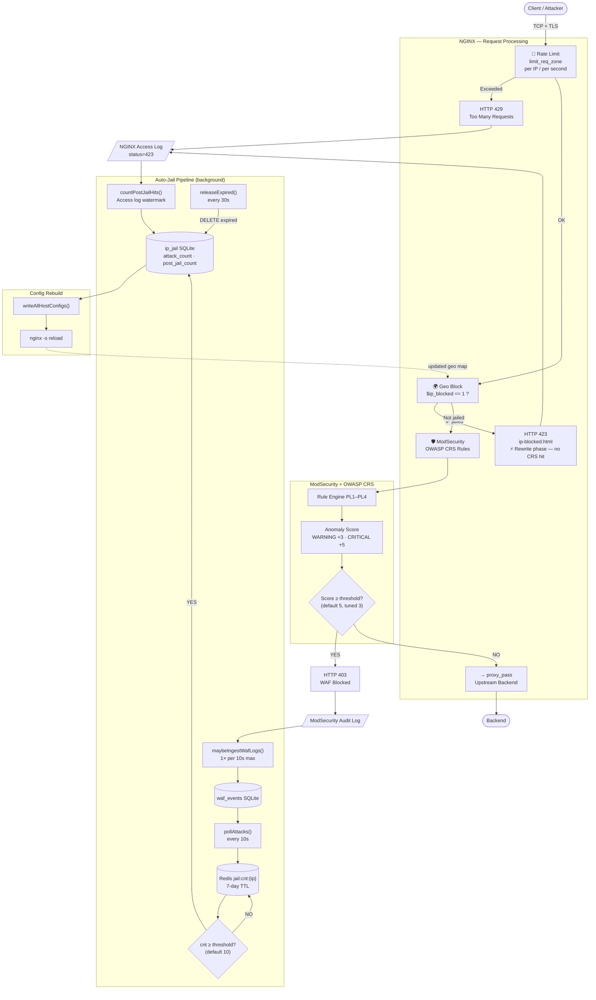

# Request Flow Layers

Every HTTP/HTTPS request through [[Ant2-Proxy-Security-Manager]] passes through five enforcement layers in a fixed order. Understanding the order is critical for diagnosing why a request was blocked, passed, or counted incorrectly.

## Full Pipeline Diagram



## Layer Order (text summary)

```
Client
  │
  ▼
[1] TCP + TLS termination          ← network layer
  │
  ▼
[2] Rate Limit (limit_req_zone)    ← NGINX, per-IP/s
  │ PASS ↓        BLOCK → HTTP 429
  ▼
[3] Geo Block ($ip_blocked)        ← NGINX rewrite phase
  │ PASS ↓        BLOCK → HTTP 423 (ip-blocked.html)
  ▼
[4] ModSecurity + OWASP CRS        ← NGINX access phase
  │ PASS ↓        BLOCK → HTTP 403 (WAF block)
  ▼
[5] proxy_pass → Backend           ← upstream
```

## Why Order Matters

**Geo block (layer 3) runs before ModSecurity (layer 4).** This has two consequences:

1. Jailed IPs never generate ModSecurity audit log entries — their requests are dropped at the rewrite phase before ModSecurity's access phase hook fires.
2. Post-jail hit counts must be sourced from the nginx access log (which logs all responses including 423), not from `waf_events`.

See [[auto-jail-pipeline]] for how post-jail 423 counts are collected via access log file-position watermarks.

## Rate Limit (Layer 2)

Configured via `limit_req_zone` in nginx. Returns HTTP **429**. 429 responses appear in the nginx access log but are NOT processed by ModSecurity and do NOT increment the auto-jail counter. An IP can be rate-limited indefinitely without ever being auto-jailed.

See [[rate-limiting-nginx]] for configuration details.

## Geo Block (Layer 3)

Nginx geo directive maps each IP to `$ip_blocked = 0|1`. Returns HTTP **423** (Locked) with `ip-blocked.html` static page showing blocked IP, timestamp, and request ID. The page uses JavaScript to toggle IP visibility.

Geo block maps are rebuilt by `writeAllHostConfigs()` and applied via `nginx -s reload` (graceful, no dropped connections). See [[geoip-country-blocking]].

## ModSecurity + OWASP CRS (Layer 4)

Anomaly scoring engine. Each matching rule adds to a running score:

| Rule severity | Score added |
|---------------|-------------|
| CRITICAL       | +5 |
| WARNING        | +3 |
| NOTICE         | +2 |
| INFO           | +1 |

If accumulated score ≥ `inbound_anomaly_score_threshold` (default 5, tunable per host), the request is blocked with HTTP **403** and logged to the ModSecurity audit log. This audit log entry is the input to the [[auto-jail-pipeline]].

See [[paranoia-levels]] and [[false-positive-false-negative-tradeoff]].

## HTTP Status Code Reference

| Code | Layer | Meaning | Feeds jail counter? |
|------|-------|---------|-------------------|
| 200  | 5 | Pass to backend | No |
| 301/302 | 5 | Redirect | No |
| 403 | 4 | WAF block (CRS) | **Yes** |
| 423 | 3 | Geo block (jailed) | No (already jailed) |
| 429 | 2 | Rate limited | No |

## Timing Budget — Time to Jail

After an attack starts, the pipeline takes up to ~20 seconds to activate the geo block:

| Step | Delay |
|------|-------|
| `maybeIngestWafLogs` rate limiter | up to 10 s |
| `pollAttacks` interval | up to 10 s |
| `writeAllHostConfigs` + nginx reload | < 1 s |
| **Total worst-case** | **~20 s** |

During this window the attacker's requests reach ModSecurity. After nginx reloads, subsequent requests return 423 without touching ModSecurity.

## See Also

- [[auto-jail-pipeline]]
- [[geoip-country-blocking]]
- [[rate-limiting-nginx]]
- [[paranoia-levels]]
- [[waf-validation-testing]]
- [[Ant2-Proxy-Security-Manager]]
