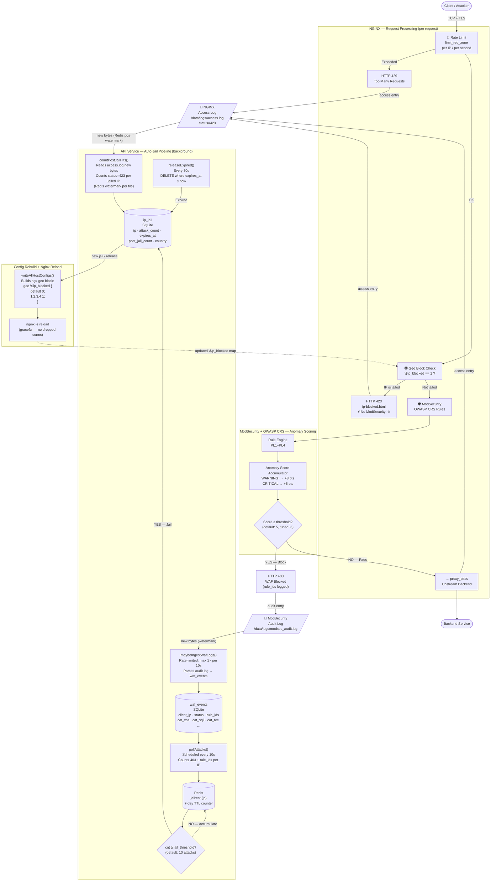

# Ant2 Proxy Security Manager — Full Request Flow Diagram

Source type: internal architecture documentation  
System: NGINX + OWASP CRS + ModSecurity + Node.js API + Redis + SQLite  
Version documented: v2.4.15  
Date: 2026-05-09

---

## Overview

Every inbound HTTP/HTTPS request passes through five enforcement layers before reaching a backend.
Blocked requests feed a detection pipeline that automatically jails repeat attackers.

---

## Layer 1 — TCP / Network

```
Client ──TCP SYN──► NGINX (port 80 / 443)
                         │
                    [TLS termination]
```

Rate limiting is applied at the connection level via `limit_req_zone` before any application logic runs.

---

## Full Request Flow



---

## Attack Count Display (UI)

The IP Jail page shows a three-tier counter per jailed IP:

```
attack_count total           ← grows continuously (WAF events after jail still counted)
  +{N} WAF after jail        ← attack_count − jailed_at_count  (parsed from reason field)
  +{N} HTTP 423 blocked      ← post_jail_count  (from access log, no WAF involved)
```

`reason` field stores: `"Auto-jailed: 11 attacks"` — regex extracts the at-jail snapshot.

---

## Timing / Latency Budget

| Event | Interval | Notes |
|-------|----------|-------|
| `maybeIngestWafLogs` rate limit | 10 s | Min gap between audit log ingestions |
| `pollAttacks` | 10 s | Scans waf_events for new 403s |
| `releaseExpired` | 30 s | Checks expired jails |
| nginx reload after jail | ~0 s | Triggered immediately after INSERT |
| **Worst-case time to jail** | **~20 s** | ingest delay + poll delay |

An attacker firing continuously can land up to ~20 s of unblocked requests before the geo block activates.

---

## HTTP Status Code Reference

| Code | Meaning | Who Returns It | Counted in jail? |
|------|---------|----------------|-----------------|
| 200 | Pass | Backend | No |
| 301/302 | Redirect | NGINX | No |
| 403 | WAF Block | ModSecurity/CRS | **Yes** — feeds jail counter |
| 423 | Geo Block (Jailed) | NGINX geo module | No (already jailed) |
| 429 | Rate Limited | NGINX limit_req | No |

---

## Key Redis Keys

| Key | Purpose | TTL |
|-----|---------|-----|
| `jail:cnt:{ip}` | Pre-jail attack counter | 7 days |
| `jail:last_event_id` | waf_events watermark | none |
| `jail:access_pos:{filename}` | access.log byte offset | none |

---

## OWASP CRS Rule Categories

| Category | DB Column | Examples |
|----------|-----------|---------|
| XSS | `cat_xss` | `<script>`, event handlers |
| SQLi | `cat_sqli` | `' OR 1=1`, `--` comment |
| RCE | `cat_rce` | shell metacharacters |
| LFI | `cat_lfi` | `../../../etc/passwd` |
| RFI | `cat_rfi` | `http://evil.com/shell.php` |
| Protocol | `cat_proto` | malformed headers, methods |
| Other | `cat_other` | scanner signatures, bad UA |

---

## Paranoia Level vs Anomaly Threshold

| PL | Rule aggressiveness | Default threshold | Block on single WARNING? |
|----|---------------------|-------------------|--------------------------|
| PL1 | Low FP | 5 | No (WARNING=3 < 5) |
| PL1 (tuned) | Low FP | **3** | **Yes** (WARNING=3 ≥ 3) |
| PL2 | Medium | 5 | No |

SQLi comment bypass (`--`, rule 942110) is a WARNING-level rule.  
At threshold=5 it never blocks alone. At threshold=3 it does.
